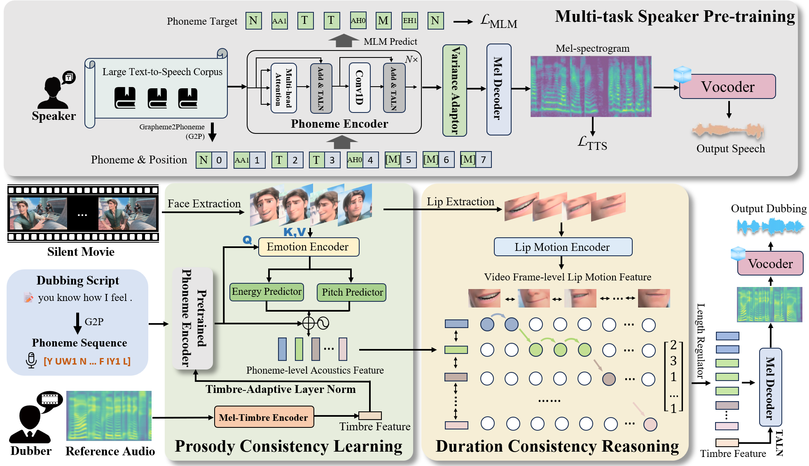

## From Speaker to Dubber: Movie Dubbing with Prosody and Duration Consistency Learning

## Abstract
Movie Dubbing aims to convert scripts into speeches that align with the given movie clip in both temporal and emotional aspects while preserving the vocal timbre of one brief reference audio. The wide variations in emotion, pace, and environment that dubbed speech must exhibit to achieve real alignment make dubbing a complex task. Considering the limited scale of the movie dubbing datasets (due to copyright) and the interference from background noise, directly learning from movie dubbing datasets limits the pronunciation quality of learned models. To address this problem, we propose a two-stage dubbing method that allows the model to first learn pronunciation knowledge before practicing it in movie dubbing. In the first stage, we introduce a multi-task approach to pre-train a phoneme encoder on a large-scale text-speech corpus for learning clear and natural phoneme pronunciations. For the second stage, we devise a prosody consistency learning module to bridge the emotional expression with the phoneme-level dubbing prosody attributes (pitch and energy). Finally, we design a duration consistency reasoning module to align the dubbing duration with the lip movement. Extensive experiments demonstrate that our method outperforms several state-of-the-art methods on two primary benchmarks. The source code and model checkpoints will be released to the public. The demos are available at this page.

### V2C-Animation sample on Dub 1.0
### Sample #1
#### Script: Every night it sneaks in my yard and gobbles my poor azaleas.
<table border="1">
    <tr>
        <td>
<video width="330" height="170" controls>
  <source src="Setting1\Sample1\StyleSpeech_Up@Carl_00_0152_00.mp4" type="video/mp4">
  Your browser does not support the video tag.
</video>
<figcaption>StyleSpeech</figcaption>
        </td>
        <td>
<video  width="330" height="170" controls>
  <source src="Setting1\Sample1\ZeroshotTTS_Up@Carl_00_0152_00.mp4" type="video/mp4">
  Your browser does not support the video tag.
</video>
<figcaption>Zeroshot-TTS</figcaption>
        </td>
        <td>
<video  width="330" height="170" controls>
  <source src="Setting1\Sample1\V2C-Net_Up@Carl_00_0152_00.mp4" type="video/mp4">
  Your browser does not support the video tag.
</video>
<figcaption>V2C-Net</figcaption>
        </td>
    </tr>
    <tr>
        <td>
<video  width="330" height="170" controls>
  <source src="Setting1\Sample1\HPMDubbing_Up@Carl_00_0152_00.mp4" type="video/mp4">
  Your browser does not support the video tag.
</video>
<figcaption>HPMDubbing</figcaption>
        </td>
        <td>
<video  width="330" height="170" controls>
  <source src="Setting1\Sample1\Ours_Up@Carl_00_0152_00.mp4" type="video/mp4">
  Your browser does not support the video tag.
</video>
<figcaption>Ours</figcaption>
        </td>
        <td>
<video  width="330" height="170" controls>
  <source src="Setting1\Sample1\Up@Carl_00_0152_00.mp4" type="video/mp4">
  Your browser does not support the video tag.
</video>
<figcaption>GT</figcaption>
        </td>
    </tr>
</table>

### Sample #2
#### Script: This is very serious.
<table border="1">
    <tr>
        <td>
<video width="320" height="140" controls>
  <source src="Setting1\sample2\StyleSpeech.mp4" type="video/mp4">
  Your browser does not support the video tag.
</video>
<figcaption>StyleSpeech</figcaption>
        </td>
        <td>
<video width="320" height="140" controls>
  <source src="Setting1\sample2\Zeroshot_TTS.mp4" type="video/mp4">
  Your browser does not support the video tag.
</video>
<figcaption>Zeroshot-TTS</figcaption>
        </td>
        <td>
<video width="320" height="140" controls>
  <source src="Setting1\sample2\V2C-Net.mp4" type="video/mp4">
  Your browser does not support the video tag.
</video>
<figcaption>V2C-Net</figcaption>
        </td>
    </tr>
    <tr>
        <td>
<video width="320" height="140" controls>
  <source src="Setting1\sample2\HPMdubbing.mp4" type="video/mp4">
  Your browser does not support the video tag.
</video>
<figcaption>HPMDubbing</figcaption>
        </td>
        <td>
<video width="320" height="140" controls>
  <source src="Setting1\sample2\Ours.mp4" type="video/mp4">
  Your browser does not support the video tag.
</video>
<figcaption>Ours</figcaption>
        </td>
        <td>
<video width="320" height="140" controls>
  <source src="Setting1\sample2\Setting1Sample2.mp4" type="video/mp4">
  Your browser does not support the video tag.
</video>
<figcaption>GT</figcaption>
        </td>
    </tr>
</table>

### Sample #3
#### Script: Everyone wants the hot, new thing.
<table border="1">
    <tr>
        <td>
<video width="320" height="140" controls>
  <source src="Setting1\sample3\StyleSpeech.mp4" type="video/mp4">
  Your browser does not support the video tag.
</video>
<figcaption>StyleSpeech</figcaption>
        </td>
        <td>
<video width="320" height="140" controls>
  <source src="Setting1\sample3\Zeroshot_TTS.mp4" type="video/mp4">
  Your browser does not support the video tag.
</video>
<figcaption>Zeroshot-TTS</figcaption>
        </td>
        <td>
<video width="320" height="140" controls>
  <source src="Setting1\sample3\V2C-Net.mp4" type="video/mp4">
  Your browser does not support the video tag.
</video>
<figcaption>V2C-Net</figcaption>
        </td>
    </tr>
    <tr>
        <td>
<video width="320" height="140" controls>
  <source src="Setting1\sample3\HPMDubbing.mp4" type="video/mp4">
  Your browser does not support the video tag.
</video>
<figcaption>HPMDubbing</figcaption>
        </td>
        <td>
<video width="320" height="140" controls>
  <source src="Setting1\sample3\ours.mp4" type="video/mp4">
  Your browser does not support the video tag.
</video>
<figcaption>Ours</figcaption>
        </td>
        <td>
<video width="320" height="140" controls>
  <source src="Setting1\sample3\Bossbaby@BossBaby_00_0241_00.mp4" type="video/mp4">
  Your browser does not support the video tag.
</video>
<figcaption>GT</figcaption>
        </td>
    </tr>
</table>

### GRID sample on Dub 1.0
#### Script: bin blue at s three again
<table border="1">
    <tr>
        <td>
<video width="320" height="200" controls>
  <source src="Setting1\sample4\Style.mp4" type="video/mp4">
  Your browser does not support the video tag.
</video>
<figcaption>StyleSpeech</figcaption>
        </td>
        <td>
<video width="320" height="200" controls>
  <source src="Setting1\sample4\ZeroshotTTS.mp4" type="video/mp4">
  Your browser does not support the video tag.
</video>
<figcaption>Zeroshot-TTS</figcaption>
        </td>
        <td>
<video width="320" height="200" controls>
  <source src="Setting1\sample4\V2C-Net.mp4" type="video/mp4">
  Your browser does not support the video tag.
</video>
<figcaption>V2C-Net</figcaption>
        </td>
    </tr>
    <tr>
        <td>
<video width="320" height="200" controls>
  <source src="Setting1\sample4\HPMDubbing.mp4" type="video/mp4">
  Your browser does not support the video tag.
</video>
<figcaption>HPMDubbing</figcaption>
        </td>
        <td>
<video width="320" height="200" controls>
  <source src="Setting1\sample4\Ours.mp4" type="video/mp4">
  Your browser does not support the video tag.
</video>
<figcaption>Ours</figcaption>
        </td>
        <td>
<video width="320" height="200" controls>
  <source src="Setting1\sample4\GT.mp4" type="video/mp4">
  Your browser does not support the video tag.
</video>
<figcaption>GT</figcaption>
        </td>
    </tr>
</table>

### V2C-Animation sample on Dub 2.0
### Sample #1
#### Script: Sentient food? That's impossible.
Reference Audio：

<audio controls src="Setting2/sample1/Cloudy@Flint_00_0134_00.wav" title="Title"></audio>
<table border="1">
    <tr>
        <td>
<video width="320" height="140" controls>
  <source src="Setting2\sample1\style.mp4" type="video/mp4">
  Your browser does not support the video tag.
</video>
<figcaption>StyleSpeech</figcaption>
        </td>
        <td>
<video width="320" height="140" controls>
  <source src="Setting2\sample1\zeroshottts.mp4" type="video/mp4">
  Your browser does not support the video tag.
</video>
<figcaption>Zeroshot-TTS</figcaption>
        </td>
        <td>
<video width="320" height="140" controls>
  <source src="Setting2\sample1\V2C-Net.mp4" type="video/mp4">
  Your browser does not support the video tag.
</video>
<figcaption>V2C-Net</figcaption>
        </td>
    </tr>
    <tr>
        <td>
<video width="320" height="140" controls>
  <source src="Setting2\sample1\HPMDubbing.mp4" type="video/mp4">
  Your browser does not support the video tag.
</video>
<figcaption>HPMDubbing</figcaption>
        </td>
        <td>
<video width="320" height="140" controls>
  <source src="Setting2\sample1\Ours.mp4" type="video/mp4">
  Your browser does not support the video tag.
</video>
<figcaption>Ours</figcaption>
        </td>
        <td>
<video width="320" height="140" controls>
  <source src="Setting2\sample1\GT.mp4" type="video/mp4">
  Your browser does not support the video tag.
</video>
<figcaption>GT</figcaption>
        </td>
    </tr>
</table>

### Sample #2
#### Script: Here's what I heard: "Blah, blah, blah."
Reference Audio：

<audio controls src="Setting2\sample2\Cloudy@Mayor_00_0844_00.wav" title="Title"></audio>

<table border="1">
    <tr>
        <td>
<video width="320" height="140" controls>
  <source src="Setting2\sample2\Style.mp4" type="video/mp4">
  Your browser does not support the video tag.
</video>
<figcaption>StyleSpeech</figcaption>
        </td>
        <td>
<video width="320" height="140" controls>
  <source src="Setting2\sample2\Zeroshot.mp4" type="video/mp4">
  Your browser does not support the video tag.
</video>
<figcaption>Zeroshot-TTS</figcaption>
        </td>
        <td>
<video width="320" height="140" controls>
  <source src="Setting2\sample2\V2Cnet.mp4" type="video/mp4">
  Your browser does not support the video tag.
</video>
<figcaption>V2C-Net</figcaption>
        </td>
    </tr>
    <tr>
        <td>
<video width="320" height="140" controls>
  <source src="Setting2\sample2\HPMDubbing.mp4" type="video/mp4">
  Your browser does not support the video tag.
</video>
<figcaption>HPMDubbing</figcaption>
        </td>
        <td>
<video width="320" height="140" controls>
  <source src="Setting2\sample2\Ours.mp4" type="video/mp4">
  Your browser does not support the video tag.
</video>
<figcaption>Ours</figcaption>
        </td>
        <td>
<video width="320" height="140" controls>
  <source src="Setting2\sample2\GT.mp4" type="video/mp4">
  Your browser does not support the video tag.
</video>
<figcaption>GT</figcaption>
        </td>
    </tr>
</table>

### Sample #3
#### Script: Well, I just saved our lives.
<audio controls src="Setting2/sample3/Inside@Disgust_00_0772_00.wav" title="Title"></audio>
<table border="1">
    <tr>
        <td>
<video width="320" height="140" controls>
  <source src="Setting2\sample3\style.mp4" type="video/mp4">
  Your browser does not support the video tag.
</video>
<figcaption>StyleSpeech</figcaption>
        </td>
        <td>
<video width="320" height="140" controls>
  <source src="Setting2\sample3\zeroshot.mp4" type="video/mp4">
  Your browser does not support the video tag.
</video>
<figcaption>Zeroshot-TTS</figcaption>
        </td>
        <td>
<video width="320" height="140" controls>
  <source src="Setting2\sample3\VC.mp4" type="video/mp4">
  Your browser does not support the video tag.
</video>
<figcaption>V2C-Net</figcaption>
        </td>
    </tr>
    <tr>
        <td>
<video width="320" height="140" controls>
  <source src="Setting2\sample3\HPMDubbing.mp4" type="video/mp4">
  Your browser does not support the video tag.
</video>
<figcaption>HPMDubbing</figcaption>
        </td>
        <td>
<video width="320" height="140" controls>
  <source src="Setting2\sample3\ours.mp4" type="video/mp4">
  Your browser does not support the video tag.
</video>
<figcaption>Ours</figcaption>
        </td>
        <td>
<video width="320" height="140" controls>
  <source src="Setting2\sample3\GT.mp4" type="video/mp4">
  Your browser does not support the video tag.
</video>
<figcaption>GT</figcaption>
        </td>
    </tr>
</table>